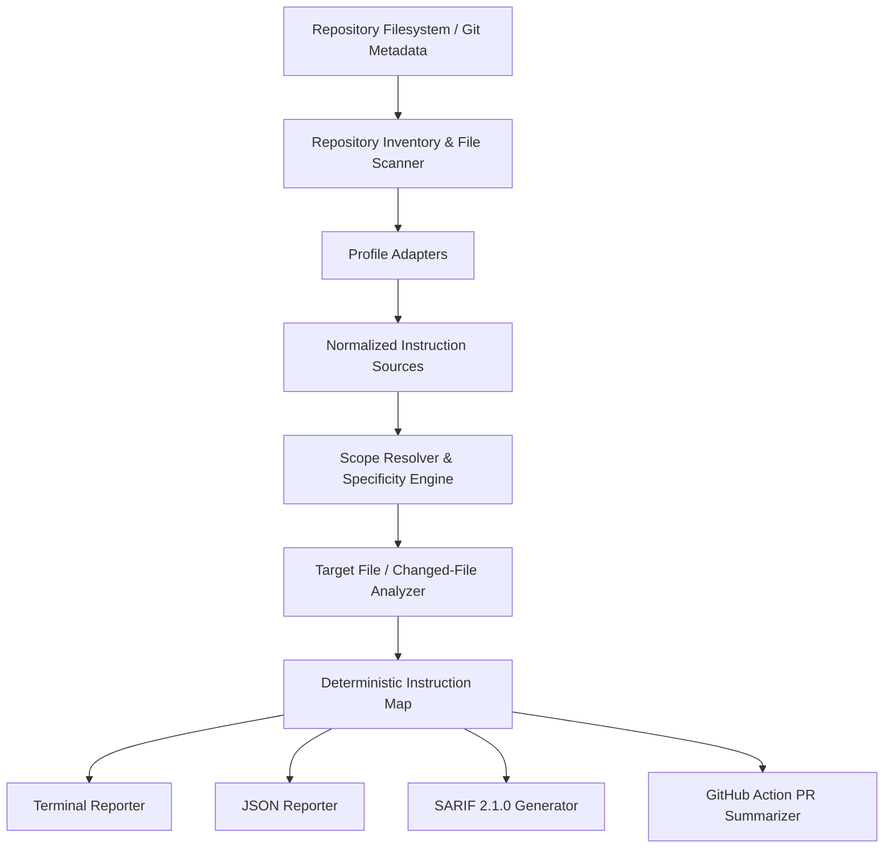

# AgentRuleMap

> **Know which AI coding-agent instructions apply before your agent edits the file.**

AgentRuleMap is a deterministic, offline static-analysis engine and CI tool that discovers AI coding-agent instruction files, models profile-aware scoping hierarchies, traces instruction provenance, detects structural conflicts, and maps change impact across git pull requests.

---

## The Problem

Modern software repositories increasingly rely on instruction files to steer autonomous AI coding agents and assistants. However, instructions often live in diverse locations with conflicting scopes, nesting behaviors, and vendor conventions:

- `AGENTS.md` (root repository instructions)
- Nested `AGENTS.md` (directory-level instructions in monorepos or packages)
- `AGENTS.override.md` (explicit precedence overrides)
- GitHub Copilot instructions (`.github/copilot-instructions.md` and `.github/instructions/*.instructions.md` with `applyTo` glob filters)
- Google Gemini instructions (`GEMINI.md` in root or nested paths)

In non-trivial codebases and monorepos, developers and maintainers often cannot answer basic governance questions:

- **Which instructions actually apply** to a given source file before an agent modifies it?
- **Which instruction wins** when multiple overlapping files exist?
- **Why did an instruction apply or get excluded** (what is the provenance and specificity rank)?
- **What instruction coverage exists** across the repository?
- **Does an incoming pull request modify instruction boundaries** for other files?
- **Do instruction files contain silent defects**, such as broken path references, invalid glob patterns, or missing npm scripts?

AgentRuleMap builds a deterministic instruction map of your codebase so developers, security teams, and CI pipelines can inspect, debug, and enforce agent rules with mathematical certainty.

---

## Why AgentRuleMap?

- **Agent instructions are invisible configuration**: Unlike compiler flags or linters, agent instructions are quiet Markdown files. When they break or conflict, agents quietly produce the wrong code or make unsafe assumptions.
- **Scoping bugs cause subtle failures**: An unclosed glob bracket or an overly broad directory instruction can silently inject frontend rules into backend authentication services.
- **Pull request blind spots**: When an engineer edits an instruction file in a PR, reviewers have no native git mechanism to see which source files are impacted by that rule change. AgentRuleMap maps git diffs directly to affected instruction scopes.
- **Deterministic and zero-network**: No AI APIs, no prompt tokens sent over the internet, no non-deterministic model calls. Fast, reproducible static analysis in milliseconds.

---

## What AgentRuleMap Is NOT

To maintain architectural focus, AgentRuleMap has strict functional boundaries:

| What It Is NOT | What AgentRuleMap Does Instead |
|---|---|
| **NOT** an AI coding agent | Analyzes the instruction files that steer agents |
| **NOT** a prompt optimizer or rewritter | Evaluates structural validity, paths, globs, and scopes |
| **NOT** an AGENTS.md generator | Audits existing instruction health and maps coverage |
| **NOT** an AI code reviewer | Maps change impact and verifies instruction integrity in CI |
| **NOT** a repository "readiness" score | Provides objective, actionable static diagnostics |
| **NOT** a semantic contradiction detector | Resolves structural precedence, overlapping scopes, and shadowing |
| **NOT** an execution engine for repository commands | Statically inspects commands without running shell scripts |

---

## Vendor Independence

> **Disclaimer**: AgentRuleMap is an independent, community-driven open-source project. It is not affiliated with, maintained by, sponsored by, or endorsed by:
> - OpenAI
> - GitHub / Microsoft
> - Google
> - Anthropic
>
> All product names, trademarks, and registered trademarks belong to their respective holders.

---

## Quick Start

Run instantly with `npx`:

```bash
# Scan and discover all instruction sources across the repository
npx agentrulemap scan

# Explain which instructions apply to a specific file under the Codex profile
npx agentrulemap explain src/api/users.ts --profile codex

# Trace full provenance and rejected candidates
npx agentrulemap trace src/api/users.ts --profile copilot

# Check for invalid globs, stale path references, and broken scripts
npx agentrulemap conflicts

# Analyze files changed in a git pull request or branch
npx agentrulemap changed --base main
```

*(Note: `npx agentrulemap` works once published to npm. In a local clone or development branch, run `npm run build && node bin/agentrulemap.js <command>` or `npm link`.)*

---

## Installation

### Local Dev Dependency (Recommended for repositories)
```bash
npm install --save-dev agentrulemap
```
Add to your `package.json` scripts:
```json
{
  "scripts": {
    "agent:check": "agentrulemap conflicts --strict",
    "agent:coverage": "agentrulemap coverage",
    "agent:changed": "agentrulemap changed --base origin/main"
  }
}
```

### Global Installation
```bash
npm install -g agentrulemap
```

### GitHub Action
Use our official reusable action in your GitHub Actions workflow:
```yaml
- uses: actions/checkout@v4
  with:
    fetch-depth: 0 # Full history required for git diff
- uses: agentrulemap/agentrulemap-action@v1
  with:
    fail-on: error
    pr-comment: true
```

---

## Primary Commands

### 1. `scan` (or `discover`)
Scans the filesystem, identifies instruction files matching the target profile, and outputs structured metadata (file path, scope type, anchor root, specificity score).

```bash
agentrulemap scan --profile codex
```

```text
Discovered 4 instruction source(s):
  • AGENTS.md [profile: codex, type: root, scopeRoot: ""]
  • apps/api/AGENTS.md [profile: codex, type: directory, scopeRoot: "apps/api"]
  • apps/web/AGENTS.md [profile: codex, type: directory, scopeRoot: "apps/web"]
  • packages/auth/AGENTS.md [profile: codex, type: directory, scopeRoot: "packages/auth"]
```

### 2. `explain` & `trace`
Resolves the effective instruction stack for a target file path according to profile-specific specificity rules. `trace` displays both matched layers and rejected candidate files with inclusion/exclusion reasons.

```bash
agentrulemap explain src/api/users.ts --profile codex
```

```text
Target: src/api/users.ts
Profile: codex (Codex / Autonomous Coding Agent)

Active Instruction Stack (2 layers in precedence order):
  Layer 0: AGENTS.md (specificity score: 0)
    ↳ Reason: Repository-level baseline instruction
  Layer 1: src/AGENTS.md (specificity score: 100)
    ↳ Reason: Hierarchical directory-level instruction applying to "src"
```

### 3. `conflicts`
Performs static-analysis audits across all instruction files, detecting objective defects without executing repository code:
- Malformed or unclosed glob patterns (`ARM002_INVALID_GLOB`)
- Empty or whitespace `applyTo` declarations (`ARM003_EMPTY_SCOPE`)
- References to non-existent files or directories (`ARM006_STALE_PATH_REFERENCE`)
- References to missing `package.json` scripts (`ARM007_MISSING_PACKAGE_SCRIPT`)
- Shadowed or redundant instruction files (`ARM012_SHADOWED_SOURCE`)

```bash
agentrulemap conflicts --strict
```

### 4. `coverage`
Maps repository-wide and path-specific instruction coverage across directories and packages.

```bash
agentrulemap coverage --profile copilot
```

### 5. `changed`
Inspects git diffs against a base branch (e.g. `main`), resolves which instructions govern newly created or modified files, and detects if changed instruction files alter scoping rules.

```bash
agentrulemap changed --base origin/main
```

---

## JSON Output & Schema Validation

Every command supports `--json` for automation and tool integration:

```bash
agentrulemap conflicts --json > report.json
agentrulemap changed --base main --json > pr-analysis.json
```

All JSON outputs strictly conform to the formal JSON Schema located at [`schema/agentrulemap-report.schema.json`](schema/agentrulemap-report.schema.json). See [`docs/json-schema.md`](docs/json-schema.md) for field definitions and compatibility guarantees.

---

## SARIF 2.1.0 & GitHub Code Scanning

AgentRuleMap natively outputs OASIS SARIF (Static Analysis Results Interchange Format) v2.1.0 logs for integration with GitHub Code Scanning:

```bash
agentrulemap conflicts --sarif > results.sarif
```

When uploaded via `@github/codeql-action/upload-sarif`, instruction findings appear directly in pull request diff annotations and repository Security tabs.

---

## Supported Profiles

| Profile | Supported Files | Scoping Mechanics |
|---|---|---|
| **`codex`** | `AGENTS.md`, `AGENTS.override.md` | Hierarchical directory inheritance, specificity depth scoring, override shadowing. |
| **`copilot`** | `.github/copilot-instructions.md`, `.github/instructions/*.instructions.md` | Repository-wide root instructions + YAML frontmatter `applyTo` glob filters. |
| **`gemini`** | `GEMINI.md` | Hierarchical directory trees and contextual scopes. |
| **`generic`** | All recognized agent instruction files | Informational repository inventory without asserting cross-vendor precedence. |

For detailed profile guides, see [`docs/profiles/`](docs/profiles/).

---

## Security Model & Offline-First Design

AgentRuleMap is engineered to be safe to run inside untrusted repositories, sensitive enterprise codebases, and air-gapped CI environments:

- **Zero Code Execution**: Static parsing only. Shell commands and npm scripts found in instructions are never executed.
- **Zero Network Access**: No HTTP requests, no telemetry, no AI model APIs.
- **Path Traversal Protection**: Rejects `..` path escapes with diagnostic `ARM009_PATH_OUTSIDE_REPOSITORY`.
- **Symlink Escape Defense**: Detects symlinks escaping the repository root with `ARM010_SYMLINK_ESCAPE`.
- **Bounded Resource Limits**: Caps instruction file sizes (1 MB limit) to prevent memory exhaustion attacks.

See [`docs/security-model.md`](docs/security-model.md) for full security documentation.

---

## Example Repositories

Explore realistic, self-contained reference setups in the [`examples/`](examples/) directory:

- [`examples/basic/`](examples/basic/): Standard single `AGENTS.md` repository.
- [`examples/nested-agents/`](examples/nested-agents/): Multi-tier nested `AGENTS.md` showing directory inheritance.
- [`examples/copilot-scopes/`](examples/copilot-scopes/): GitHub Copilot path-specific `applyTo` rules.
- [`examples/monorepo/`](examples/monorepo/): Workspace monorepo with multiple apps, packages, and scopes.
- [`examples/broken-repo/`](examples/broken-repo/): Intentionally broken repository demonstrating diagnostic findings (`ARM002`, `ARM003`, `ARM006`, `ARM007`).

---

## Architecture Overview



For in-depth architectural descriptions, see [`docs/architecture.md`](docs/architecture.md).

---

## Current Limitations

- **Syntactic, not semantic**: AgentRuleMap verifies syntax, globs, paths, and structural precedence. It does not attempt to evaluate natural-language semantic meaning or resolve conflicting prose requirements within the same markdown file.
- **Client runtime configurations**: User-level client flags (e.g. personal CLI settings in `~/.config`) are outside the static analysis scope of the repository.

---

## Roadmap

- [x] Hierarchical `AGENTS.md` and `AGENTS.override.md` resolution
- [x] Copilot `.github/instructions/*.instructions.md` with `applyTo` globs
- [x] Deterministic conflict detection engine with stable `ARMxxx` diagnostics
- [x] Git changed-file impact analysis and PR scope change detection
- [x] GitHub Action with sticky PR comments and step summaries
- [x] OASIS SARIF 2.1.0 output for GitHub Code Scanning
- [ ] Language-server protocol (LSP) extension for real-time in-editor instruction hover and diagnostics
- [ ] Interactive terminal visualizer for large monorepo instruction trees

---

## Local Development & Testing

```bash
# Clone and install dependencies
git clone https://github.com/agentrulemap/agentrulemap.git
cd agentrulemap
npm install

# Run automated tests
npm test

# Run TypeScript typecheck
npm run typecheck

# Run the deterministic demo against example repositories
npm run demo

# Build the CLI and Action binaries
npm run build
```

---

## Contributing

We welcome contributions! Please review our [`CONTRIBUTING.md`](CONTRIBUTING.md) and [`docs/contributing-guide.md`](docs/contributing-guide.md). If you'd like to add support for a new AI coding agent format, consult [`docs/adding-a-profile.md`](docs/adding-a-profile.md).

All participants are expected to adhere to the [`CODE_OF_CONDUCT.md`](CODE_OF_CONDUCT.md).

---

## License

AgentRuleMap is licensed under the [MIT License](LICENSE).
