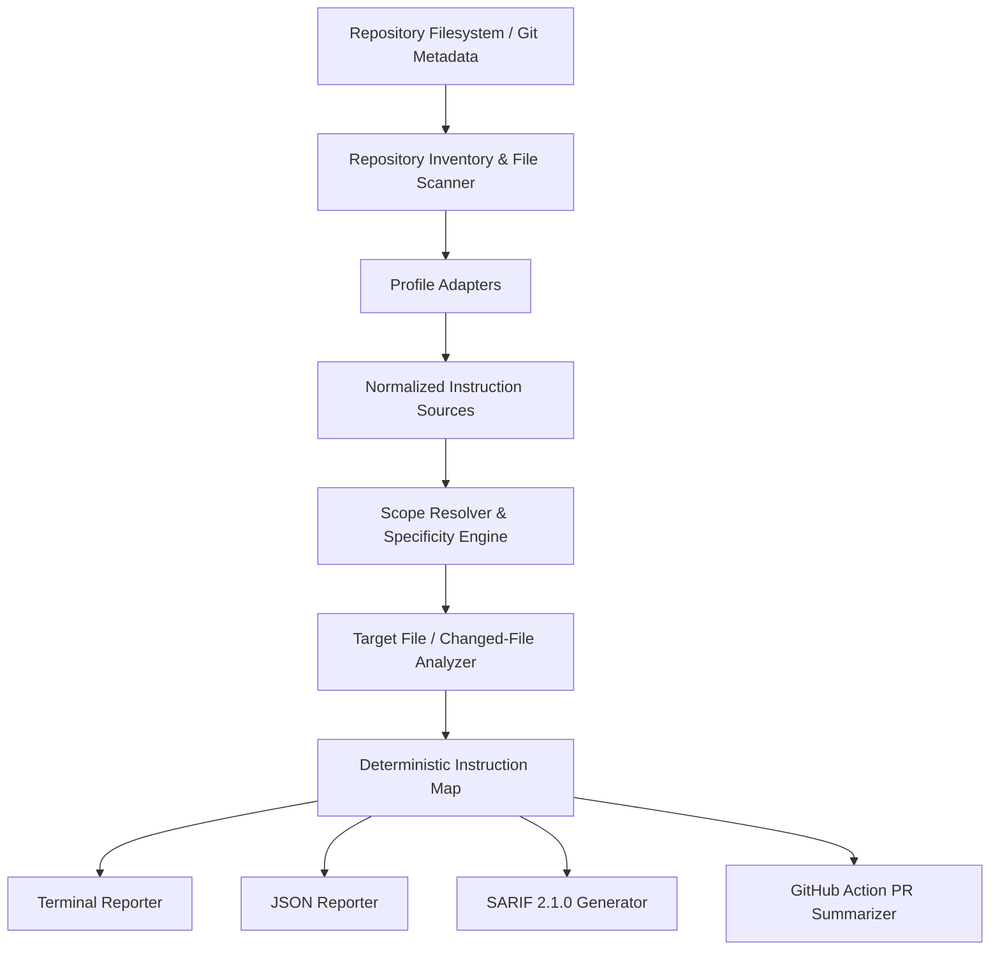

# AgentRuleMap Architecture

AgentRuleMap is engineered as a zero-network, deterministic static-analysis engine. It audits repository structure, discovers AI coding-agent instruction files, models profile-specific scoping semantics, and maps instruction governance across individual files, directory trees, and pull request changes.

---

## Architectural Flow

---

## Architectural Layers

### 1. CLI Layer (`src/cli/index.ts`)
The user entrypoint powered by Commander.js. Provides a consistent command-line interface:
- `scan` / `discover`: Discovers all instruction sources for a profile.
- `explain` / `trace` / `resolve`: Evaluates the effective instruction stack for a target path.
- `conflicts`: Audits structural defects, stale references, and invalid scopes.
- `coverage`: Displays coverage maps across repository directories.
- `changed`: Analyzes git diffs, working tree changes, and pull request files.

### 2. Commands Layer (`src/commands/`)
Decoupled command handlers that orchestrate engines, handle options parsing, enforce strict-mode exit codes, and select appropriate output formatters:
- `resolveCommand.ts`
- `conflictsCommand.ts`
- `coverageCommand.ts`
- `changedCommand.ts`

### 3. Core Analysis Engine (`src/core/`)
The central coordinator:
- `InstructionEngine`: Initializes repository context, binds profile adapters, and routes discovery and resolution queries.
- `scopeResolver.ts`: Computes directory ancestor matches, glob evaluations, and specificity ranks.
- `pathParser.ts`: Enforces repository boundary constraints and prevents directory traversal.

### 4. Profile Adapters (`src/adapters/`)
Encapsulates ecosystem-specific rules:
- `codexAdapter.ts`: Manages `AGENTS.md`, nested directory trees, and `AGENTS.override.md`.
- `copilotAdapter.ts`: Manages `.github/copilot-instructions.md` and `.github/instructions/*.instructions.md` with YAML `applyTo` parsing.
- `geminiAdapter.ts`: Manages `GEMINI.md` hierarchical directory trees.
- `genericAdapter.ts`: Provides a unified inventory of all discovered instruction files.
- `registry.ts`: Adapter registry and profile lookup.

### 5. Repository Inventory & Caching (`src/scanners/`, `src/utils/`)
High-performance, filesystem-safe inventory:
- `fileScanner.ts`: Discovers instruction files, parses frontmatter safely, and caches filesystem trees.
- `pathUtils.ts`: Normalizes POSIX paths, directory depth, and boundary validation.

### 6. Diagnostics Engine (`src/diagnostics/`)
Rules-based static validation:
- `registry.ts`: Central catalog of stable `ARMxxx` diagnostic definitions with titles, severity levels, remediation steps, and strict-mode policies.
- `conflictEngine.ts`: Detects broken paths, missing package scripts, malformed globs, empty scopes, and shadowed files.

### 7. Git & Changed Analysis (`src/git/`, `src/changed/`)
Safe, read-only Git interaction:
- `safeGit.ts`: Executes bounded `git status`, `git diff`, `git rev-parse` with timeout controls and strict sanitization.
- `changedEngine.ts`: Maps changed files against instruction stacks, detects instruction modifications, and evaluates scope transitions on renames.

### 8. Reporters (`src/reporters/`)
Formats deterministic outputs:
- `terminalReporter.ts`: Human-readable terminal output using Chalk.
- `jsonReporter.ts`: Machine-readable JSON output conforming to the schema.
- `sarifReporter.ts`: OASIS SARIF 2.1.0 log format for GitHub Code Scanning integration.
- `src/action/`: Self-contained GitHub Action with step summary generation and PR comments.
